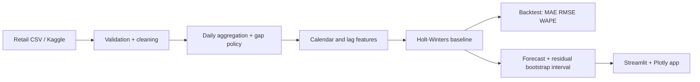

# Demand Forecasting in Retail

[Open the live Streamlit app](https://demand-forecasting-retail.streamlit.app/)

A production-minded retail demand forecasting project for inventory planning. It converts granular retail sales into a continuous daily demand signal, trains a seasonal Holt-Winters model, produces 30/60/90-day forecasts with residual-bootstrap planning intervals, and exposes the workflow through Streamlit.

## Day 1: run the data and model pipeline

```powershell
python -m pip install -r requirements.txt
python src/generate_data.py
python src/train_forecast.py --horizon 30
```

The synthetic panel contains `date`, `store`, `item`, and `sales`. It is deliberately reproducible and includes weekday seasonality, annual seasonality, trend, promotions, multiple stores, and multiple products. For a public dataset, download the Walmart or Store Item Demand Forecasting CSV, rename its date/target columns to `date`/`sales`, then pass its path to `src/train_forecast.py`.

## Architecture



## Modeling choices

The baseline uses additive trend and weekly seasonality. Metrics use expanding-window rolling-origin backtesting, so each fold trains only on observations available at that point in time. Intervals are empirical predictive/planning intervals generated by bootstrapping historical residuals; they are not formal parameter confidence intervals. This distinction is intentional and should be explained in an interview.

## Run the interactive app

```powershell
streamlit run app.py
```

The app supports CSV upload, all-store/all-item or slice-level forecasting, 30/60/90-day horizons, interactive Plotly exploration, historical context controls, and CSV downloads for both forecast values and backtest metrics.

## Hiring-manager talking points

- Designed a leakage-safe time-series pipeline with an explicit missing-date policy.
- Used rolling-origin holdout evaluation and WAPE, a business-friendly metric for demand planning.
- Exposed uncertainty as an interval and clearly distinguished predictive planning intervals from parameter confidence intervals.
- Kept ingestion, feature engineering, modeling, evaluation, and presentation modular so the baseline can be replaced by Prophet, ARIMA, or a global panel model.

## Evaluation and limitations

The app compares Holt-Winters against a weekly seasonal-naive forecast over three non-overlapping holdout windows at the selected 30/60/90-day horizon. Each fold uses an expanding training window. MAE, RMSE and WAPE pool all held-out observations; WAPE is undefined when total actual demand is zero. At least `14 + 3 * horizon` days are required. Short datasets produce an explicit error rather than a different evaluation horizon.

Observed coverage is reported for the approximate 90% residual-bootstrap bands. These bands do not propagate trend or parameter uncertainty and are not calibrated guarantees. The included data are synthetic and cannot support claims of business impact. Calendar/rolling features are diagnostic extensions; Holt-Winters only consumes the target sequence. Missing dates are rejected unless zero filling is explicitly selected in the app. Invalid dates, negative targets and nonfinite targets are rejected.

Run verification with `python -m pytest`. Tests cover daily preparation, weekly baseline alignment, horizon boundaries, and Streamlit controls. Deployment and browser download verification remain separate steps.

## Next improvements

- Compare against additional Prophet/ARIMA candidates.
- Add holiday/promotion regressors and forecast-to-inventory KPIs such as expected stockout risk.
- Add CI and a deployed Streamlit link.
